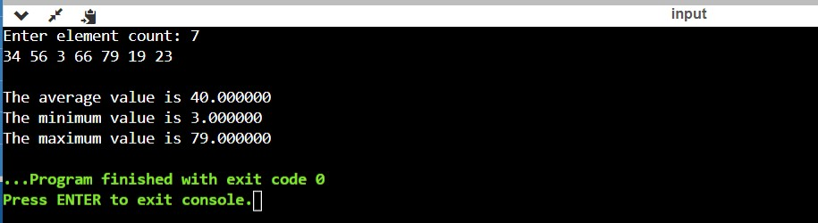
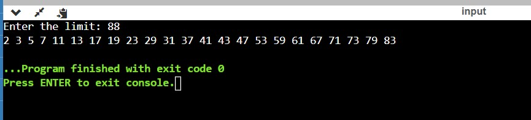

# 4.22 Writing a Multi-Threaded Program

Write a multithreaded program that calculates various statistical values
for a list of numbers. This program will be passed a series of numbers
on the command line and will then create three separateworker threads.
One thread will determine the average of the numbers, the second will
determine the maximum value, and the third will determine the minimum
value. 

For example, suppose your program is passed the integers
90 81 78 95 79 72 85

>The program will report 
>The average value is 82 
>The minimum value is 72 
>The maximum value is 95 

The variables representing the average, minimum, and maximum values
will be stored globally. The worker threads will set these values, and
the parent thread will output the values once the workers have exited.
(We could obviously expand this program by creating additional threads
that determine other statistical values, such as median and standard
deviation.)

## Solution

First we define the global variables as asked in the question named average, maximum and minimum.  
The other global variables used will be maximum size of an array, an array, count of an element, loop counter and an array nmed worker_threads of size three. 

We define the input function in order to get values to be stored in an array and operations to be performed on them.  

We define 3 functions for start_routine namely thread_average, thread_minimum, thread_maximum.  

## Screenshot of a test case:

# 4.23 Writing a Multi-Threaded Program

Write a multithreaded program that outputs prime numbers. This program
should work as follows: The user will run the program and will
enter a number on the command line. The program will then create a
separate thread that outputs all the prime numbers less than or equal to
the number entered by the user.

## Solution

We define global array whose maximum size is alredy given. A variable N is also declared globally whose value will be the number below which we want all prime numbers to be displayed as an output of the program.  

Two functions named * *printprime* and * *print* are defined. Printprime function checks for prime numbers from 2 to given number and makes the array value corresponding to that index 1. Print function prints the prime numbers from 2 to that number. 

The threads are used to carry out aforementioned work.  

## Screenshot of a test case:

